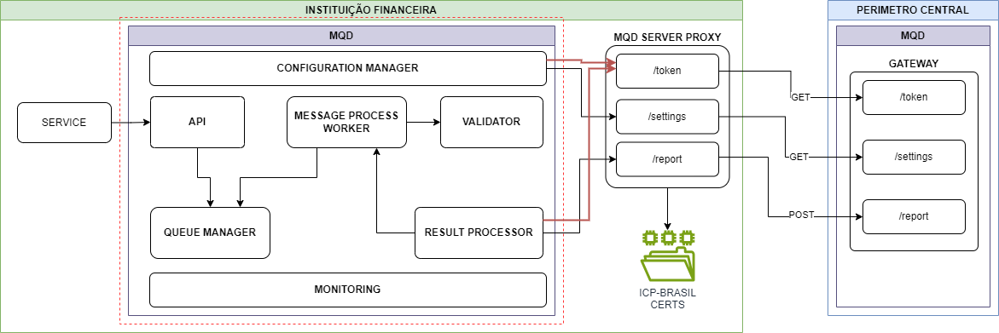

# Documentação de Arquitetura MQD

1. [Arquitetura](#arquitetura)
2. Diagramas de Sequencia
    1. [Fluxo Receptora](FLUXO%20RECEPTORA.md)
    2. [Fluxo Transmissora](FLUXO%20TRANSMISSORA.md)
    3. [Fluxo de Atualização de Configuração](FLUXO%20ATUALIZACAO%20DE%20CONFIGURACAO.md)
    4. [Fluxo Validation](./FLUXO_VALIDATION.md)
    5. [Fluxo Results](./FLUXO_RESULTS.md)

## Arquitetura 

Apesar de ter sido criada como um monólito, a aplicação MQD – Client foi desenvolvida com um desacoplamento em componentes, o que permitirá futuramente dividi-la em secções menores (mycorservices) se necessário.

## Componentes

| Serviço | Descrição | Tecnologia | Versão |
|---|---|---|---|
| SERVICE | Serviço executado na RECEPTORA que envia a resposta obtida ao MQD | N.A | N.A |
| CONFIGURATION MANAGER | Componente responsável por ler os arquivos de configuração e estabelecer os valores encontrados para que a aplicação possa utilizá-los | Go | 1.20 |
| MONITORING | Componente responsável pela criação das métricas da aplicação, tanto de desempenho quanto de negócio | Go   OpenTelemetry | 1.20 |
| API | API REST que expõe os métodos necessários para validar as mensagens da RECEPTORA | Go | 1.20 |
| QUEUE TASK | Linha que armazena as mensagens recebidas pela API | Go | 1.20 |
| MESSAGE PROCESS WORKER | Componente que lê a fila de tarefas e processa cada uma das mensagens | Go | 1.20 |
| VALIDATOR | Componente que valida mensagens convertendo-as em objetos e executando uma validação baseada em um esquema JSON para cada um dos endpoints | Go | 1.20 |
| QUEUE RESULTS |  Linha que salva os resultados das mensagens já validadas | Go | 1.20 |
| RESULT PROCESSOR | Componente responsável por processar os resultados, criando um resumo de cada janela de tempo (definida na configuração) e enviando-os ao servidor MQD | Go | 1.20 |
| MQD SERVER PROXY |  | Go | 1.20 |
| GATEWAY |  | Go | 1.20 |
