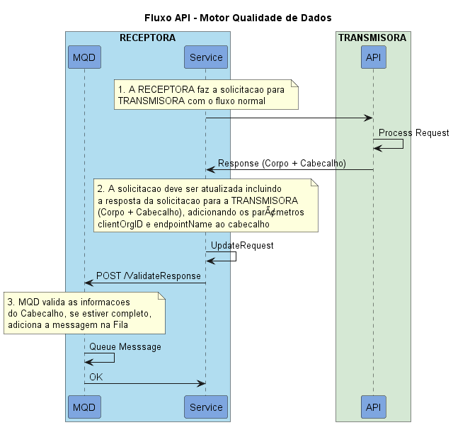

# Fluxo API

Este fluxo representa o processo de enfileramento de messagens e integração com o MQD

## Passos

| Step | Participante | Descrição |
|-|-|-|
| 1. | Service | O serviço gera uma solicitação para a API da TRANSMISORA |
| 2. | API | A API processa a solicitação recebida |
| 3. | API | A API retorna um resultado para a solicitação |
| 4. | Service | O Serviço gera uma nova requisição, tendo como base a Resposta da TRANSMISORA, incluindo no cabeçalho o valor de [EndpointName] e [serverOrgId] que indica o ID do transmissor |
| 5. | Service | O serviço envia a nova solicitação para a API do MQD  |
| 6. | MQD | MQD Valida se as informações do cabeçalho estão completas e corretas |
| 7. | MQD | MQD encaminha as informações para serem processadas posteriormente |
| 8. | MQD | MQD responde OK se o processo foi bem-sucedido |

