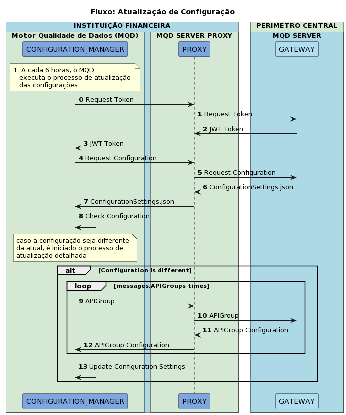
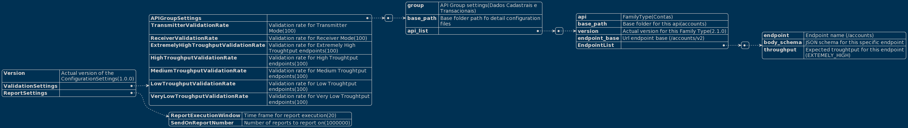

# Fluxo Atualização de COnfiguração

Este fluxo representa o processo de atualização de configuração

## Passos

| Step | Participante | Descrição |
|-|-|-|
| 0. | CONFIGURATION_MANAGER |  |
| 1. | PROXY |  |
| 2. | GATEWAY |  |
| 3. | PROXY |  |
| 4. | CONFIGURATION_MANAGER |  |
| 5. | PROXY |  |
| 6. | GATEWAY |  |
| 7. | PROXY |  |
| 8. | CONFIGURATION_MANAGER |  |
| 9. | CONFIGURATION_MANAGER |
| 10. | PROXY |  |
| 11. | GATEWAY |
| 12. | PROXY |  |
| 13. | CONFIGURATION_MANAGER |

## Esquema de Definições de Configuração

