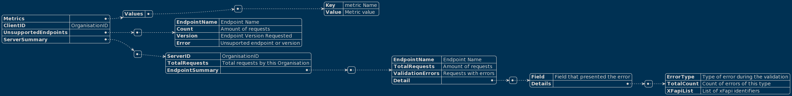

# Fluxo Resultados

Este fluxo representa o processo de validação executado na aplicação

## Passos

| Step | Participante | Descrição |
|-|-|-|
| 0. | RESULT_PROCESSOR | A cada intervalo definido o Componente inicia seu processo |
| 1. | RESULT_PROCESSOR | O componente solicita ao Validador a lista de resultados a serem processados |
| 2. e 3. | VALIDADOR | Após retornar os resultados, o validador limpa a lista para um novo processo |
| 4. | RESULT_PROCESSOR | O componente gera um novo resumo com a lista de resultados obtidos |
| 5. | RESULT_PROCESSOR | O componente solicita um token de acesso ao proxy do servidor |
| 6. | PROXY | Solicita o token ao servidor utilizando certificados para estabelecer mTLS |
| 7. e 8. | GATEWAY | O Gateway usa as credenciais para validar a ID do Cliente e obtem um token JWT, enviando ao Proxy |
| 9. | PROXY |  |
| 10. | RESULT_PROCESSOR | O componente envia o resumo criado para o servidor usando o token recebido como autorização |
| 11. | PROXY |  |
| 12. | GATEWAY | O Gateway valida o acesso ao recurso (MQD_SERVER) com base no token recebido |
| 13. | GATEWAY |  |
| 14. e 15. | GATEWAY | Gateway retorna a resposta do servidor para o componente Result Processor |

## Esquema de Report Enviado

