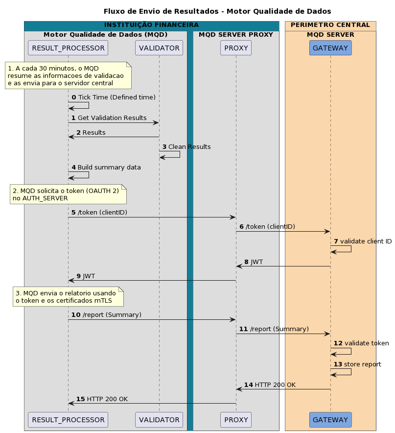

# Fluxo Resultados

Este fluxo representa o processo de validação executado na aplicação

## Passos

| Step | Participante | Descrição |
|-|-|-|
| 0. | Results | A cada intervalo definido o Componente inicia seu processo |
| 1. | Results | O componente solicita ao Validador a lista de resultados a serem processados |
| 2. | Validator | Após retornar os resultados, o validador limpa a lista para um novo processo |
| 3. | Results | O componente gera um novo resumo com a lista de resultados obtidos |
| 4. | Results | O componente solicita um token de acesso do servidor usando as credenciais do servidor (RECEPTORA) |
| 5. | API_GATEWAY | O Gateway usa as credenciais e as envia ao componente de autorização para obter um token JWT |
| 6. | Results | O componente envia o resumo criado para o servidor usando o token recebido como autorização |
| 7. | API_GATEWAY | O Gateway valida o acesso ao recurso (MQD_SERVER) com base no token recebido |
| 8. | API_GATEWAY | Se o Token for válido, o Gateway envia a solicitação ao Servidor MQD |
| 9. | MQD_SERVER | O servidor armazena o relatório enviado |
| 10. | MQD_SERVER | Se tudo estiver correto o Servidor responde ok OK HTTP 200 |
| 11. | API_GATEWAY | Gateway retorna a resposta do servidor para o componente Resultados |