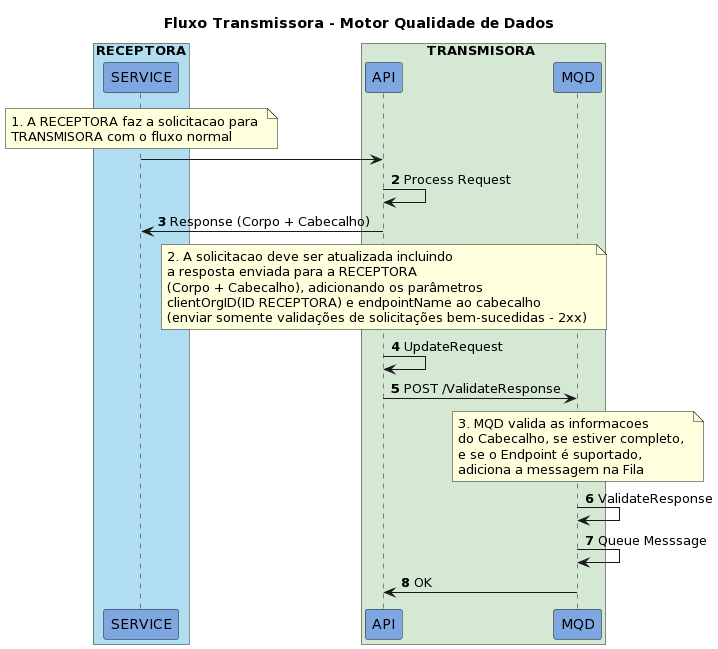

# Fluxo TRANSMISSORA

Este fluxo representa o processo de enfileramento de messagens e integração com o MQD na visão da RECEPTORA

## Passos

| Step | Participante | Descrição |
|-|-|-|
| 1. | SERVICE | O serviço gera uma solicitação para a API da TRANSMISORA |
| 2. | API | A API processa a solicitação recebida |
| 3. | API | A API retorna um resultado para a solicitação |
| 4. | API | A API atualiza a solicitação, incluindo a resposta enviada para a RECEPTORA - Corpo+Cabeçalho - e adicionando oa parâmetros clientOrgID - o ID da RECEPTORA - e endpointName ao cabeçalho |
| 5. | API | A API da TRANSMISSORA envia a nova resposta válida para o MQD  |
| 6. | MQD | MQD Valida se as informações do cabeçalho estão completas e corretas |
| 7. | MQD | MQD encaminha as informações para serem processadas posteriormente |
| 8. | MQD | MQD responde OK se o processo foi bem-sucedido |