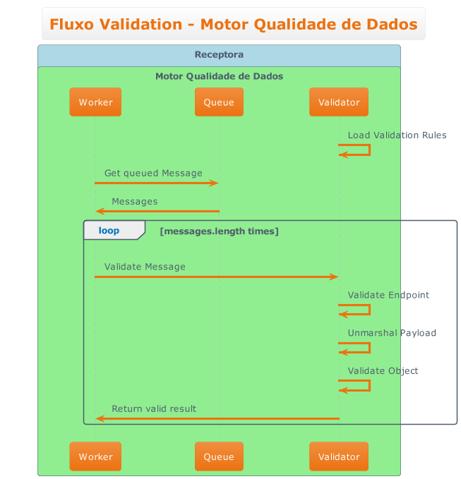

# Fluxo validação

Este fluxo representa o processo de validação executado na aplicação

## Passos

| Step | Participante | Descrição |
|-|-|-|
| 0. | Validator | O componente de validação carrega regras de validação com base em arquivos JSON de configuração |
| 1. | Worker | O componente Worker solicita à Fila a lista de tarefas enfileiradas a serem processadas |
| 2. | Worker | Para cada uma das mensagens encontradas, o Worker envia a mensagem para o componente Validação |
| 3. | Validator | O componente valida se o Endpoint está na lista de endpoints válidos |
| 4. | Validator | O componente valida se o Endpoint está na lista de endpoints válidos |
| 5. | Validator | O componente valida o objeto usando um esquema JSON carregado anteriormente |
| 6. | Validator | Retorna a resposta de validação ao Worker |